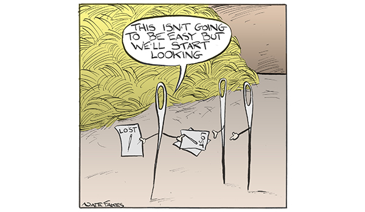

```{r, echo=FALSE, include=FALSE}
knitr::opts_chunk$set(echo = FALSE)
```

## Describe Your Dataset

* Electronic Medical Records
    + Relational database
    + 2009 to 2017
    + Deidentified
    + 21.5 million inpatient encounters (hospital visits)
    + 132 million microbiology lab data
    + Administrative diagnoses and procedures
    + Other patient demogrphic data (hospital IDs, census region, age, sex, etc.)
    


Subset:
Specimen with bacteria - *Stenotrophomonas maltophilia* because of 1. the size, 2. my research interest.
I have subsetted this dataset with MS SQL Server.

(the subset is only 90506 rows)

## Problem and End User
###Problem/Goal:  

Overall Goal - To be familiar with various R features and capabilities.

Adding R to our toolbox to expand the range of research methods we can apply as well as more efficient ways for me as a data manager to wrangle data.

```{r}
#The epidemiology unit supports any research interest of clinicians in the division of intramural research in NIAID, so we have a wide variety of research topic within the world of immunology and infectious diseases. We have a lot of different types of datasets that we can conduct research projects from based on different disease characteristics.
#Eg. disease prevalent in older population in Medicare datasets
#I am mainly responsible for the management of one of the large EHR data which I will go over later.

#Because of the variety of datasets we have and the research flexibility, I have a lot of freedom in choosing what I'd want to do and they would all still be very applicable to what we're doing.
```


```{r}
#My role as a Data Manager:

#1. Support any research interest within the group
#2. Subset data based on disease definition or other criteria
#3. Keep track of project flow and selection criteria for each project
#4. Also conduct research project of my own
```

Problems:

- To classify each specimen into major culture types (eg. blood culture, urine culture, sputum culture etc.)
```{r}
#- you'd think that this should be fairly simple, but these information currently reside in 3 separate variables and they're not always clean. as you can imagine the permutation and combination of these 3 variables will become a list of 100s or even 1000s to be reviewed by researchers.
```

- Compare the effectiveness of 2 antibiotics in *Stenotrophomonas maltophilia* infected cohort

###End User(s):

Principal investigators who need to identify specific patients (myself included) and conduct outcome analyses on them
    

## Variables of Interest and Distribution
```{r loaddata, include=FALSE, echo = FALSE}
library(tidyverse)
library(Hmisc)
library(chron)
####read in CSV####
steno<-read.csv("steno.csv", header=TRUE)

colnames(steno)[1]<-"ENCOUNTER_ID"
names(steno)

####adjust format for variables####
steno$ISOLATE_NAME_CHAR<-as.character(steno$ISOLATE_NAME)


#separate date and time#
steno1<-separate(steno, FIRST_REPORT_ENTERED_DT_TM, 
              into=c("FIRST_REPORT_ENTERED_DT", "FIRST_REPORT_ENTERED_TM"),
              sep=" ",
              convert=TRUE)%>%
  separate(LAST_REPORT_UPDATED_DT_TM,
           into=c("LAST_REPORT_UPDATED_DT", "LAST_REPORT_UPDATED_TM"),
           sep=" ",
           convert=TRUE)%>%
  separate(MICRO_LAB_COMPLETED_DT_TM,
           into=c("MICRO_LAB_COMPLETED_DT", "MICRO_LAB_COMPLETED_TM"),
           sep=" ",
           convert=TRUE)%>%
  separate(MICRO_LAB_CANCELLED_DT_TM,
           into=c("MICRO_LAB_CANCELLED_DT", "MICRO_LAB_CANCELLED_TM"),
           sep=" ",
           convert=TRUE)%>%
  separate(MICRO_LAB_DRAWN_DT_TM,
           into=c("MICRO_LAB_DRAWN_DT", "MICRO_LAB_DRAWN_TM"),
           sep=" ",
           convert=TRUE)%>%
  separate(MICRO_LAB_ORDERED_DT_TM,
           into=c("MICRO_LAB_ORDERED_DT", "MICRO_LAB_ORDERED_TM"),
           sep=" ",
           convert=TRUE)%>%
  separate(MICRO_LAB_RECEIVED_DT_TM,
           into=c("MICRO_LAB_RECEIVED_DT", "MICRO_LAB_RECEIVED_TM"),
           sep=" ",
           convert=TRUE)


steno1$FIRST_REPORT_ENTERED_DT_TM<-chron(dates=steno1$FIRST_REPORT_ENTERED_DT, times=steno1$FIRST_REPORT_ENTERED_TM,
                                      format=c('y-m-d','h:m:s'))
steno1$LAST_REPORT_UPDATED_DT_TM<-chron(dates=steno1$LAST_REPORT_UPDATED_DT, times=steno1$LAST_REPORT_UPDATED_TM,
                                     format=c('y-m-d','h:m:s'))
steno1$MICRO_LAB_COMPLETED_DT_TM<-chron(dates=steno1$MICRO_LAB_COMPLETED_DT, times=steno1$MICRO_LAB_COMPLETED_TM,
                                     format=c('y-m-d','h:m:s'))
steno1$MICRO_LAB_CANCELLED_DT_TM<-chron(dates=steno1$MICRO_LAB_CANCELLED_DT, times=steno1$MICRO_LAB_CANCELLED_TM,
                                     format=c('y-m-d','h:m:s'))
steno1$MICRO_LAB_DRAWN_DT_TM<-chron(dates=steno1$MICRO_LAB_DRAWN_DT, times=steno1$MICRO_LAB_DRAWN_TM,
                                 format=c('y-m-d','h:m:s'))
steno1$MICRO_LAB_ORDERED_DT_TM<-chron(dates=steno1$MICRO_LAB_ORDERED_DT, times=steno1$MICRO_LAB_ORDERED_TM,
                                   format=c('y-m-d','h:m:s'))
steno1$MICRO_LAB_RECEIVED_DT_TM<-chron(dates=steno1$MICRO_LAB_RECEIVED_DT, times=steno1$MICRO_LAB_RECEIVED_TM,
                                    format=c('y-m-d','h:m:s'))
```
For the automation of sorting culture type:
```{r colnames, echo=FALSE}
colnames(steno1[c(29,30,31)])
```
Here's a sample of the grouped data:
```{r}
combocounts<-group_by(steno1, LAB_PROCEDURE_NAME, COLLECTION_SOURCE_DESC, COLLECTION_SITE_DESC)%>%summarise(NUM_ENCOUNTERS=n_distinct(ENCOUNTER_ID))%>%arrange(desc(NUM_ENCOUNTERS))
print(head(combocounts))
```

Variables to control in logistic regression/propensity matching for comparing antibiotic effectiveness:

- sex
- age
- geographic area
- severity of illness
- comorbidities

## Supervised or Unsupervised?
Culture type classification:

Supervised - a set number of clinically relevant culture types for each specimen to be classified

Logistic regression to compare odds of mortality is also supervised.

**Target variables:**

Culture type classification: One "culture type" variable (eg. Blood, Urine, Sputum, etc.)

Comparative effectiveness: Odds of mortality - one for patients in each antibiotic treatment group and comare them

##Challenges?

- Will need a lot of input from physicians to determine biological and clinical significance
- Merging in R (relational database, currently on SQL server)

##Plan of Action

```{r}
library(DiagrammeR)
mermaid("
gantt
dateFormat  YYYY-MM-DD
title Action Plans

section Odds of Mortality Comparison Regression
Obtain microbiology data and prep           :done,          first_1,    2018-06-14, 2018-06-26
Clean-up and reshape                        :active,        first_1_5,  2018-06-27, 7d
Merge medication and demographic data           :active,       first_2,    2018-06-29, 14d
Final clean-up                :               first_3,    after first_2, 7d
Design regression model            :               first_4,    after first_3, 3d
Run regression model               :               first_5,    after first_4, 3d


section Culture Type Classification
Learn about automated classification                 :active,        extras_1,   2018-06-27,  7d
Reshape data and prep                :               extras_2,   after extras_1, 7d
Design program            :               extras_3,   after extras_2, 7d
Execute                   :               extras_4,   after extras_3, 3d
Fine tune                 :               extras_5,   after extras_4, 3d

")

```

